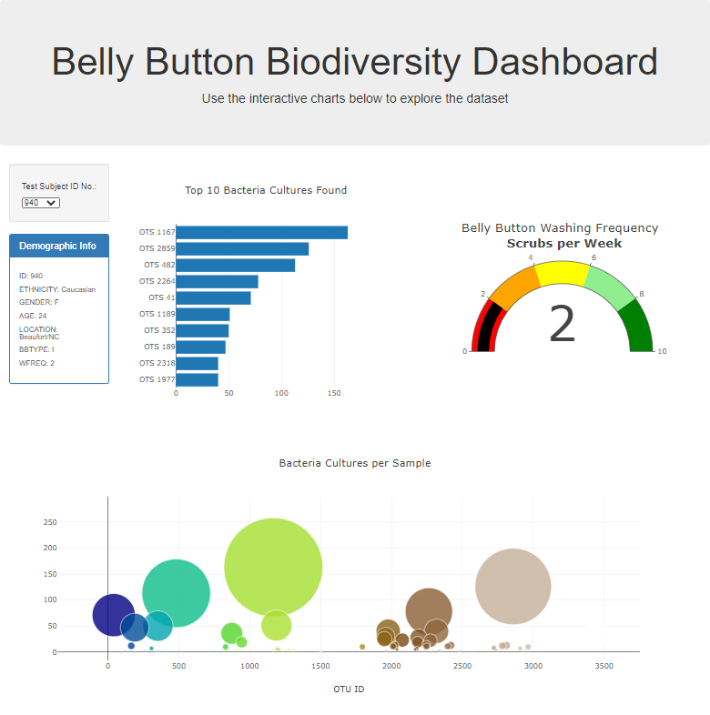

# Belly Button Biodiversity Dashboard

## Overview
This project is the 12th weekly challenge of the Data Science Bootcamp. It allows us to put into practice and showcase the skills learned in Module 12 of the bootcamp.

### Purpose
I completed and improved the dashboard displaying the Belly Button Biodiversity data.
By selecting test subject ID, the users of the dashboard can obtain the demographic information associated with the sample, a chart of the top 10 bacterial species, an indicator of washing frequency and a bubble chart with all the cultures present in the subject.

## Results

The project can be accessed on:  [https://jose-perth.github.io/plotly_deployment/](https://jose-perth.github.io/plotly_deployment/)

The following files and folders are part of the project:

- [index.html](./index.html)
- [static/css/style.css](./static/css/style.css):  css file with additional formatting.
- [static/js/charts.js](./static/js/charts.js): script file.
- [static/images/](./static/images): folder containing images used by web file.
- [samples.json](./samples.json) data file.

### Deliverable 1: Create a Horizontal Bar Chart

The function ```buildCharts``` was created to take the *Test Subject ID* selected and create a horizontal bar chart of the top 10 samples recorded for the test subject.

```js
function buildCharts(sample) {
  // 2. Use d3.json to load samples.json file 
  d3.json("samples.json").then((data) => {
    // 3. Create a variable that holds the samples array. 
    let samplesArray = data.samples;
    // 4. Create a variable that filters the samples for desired sample ID.
    let samplesFiltered = samplesArray.filter(x=>x.id == sample);
    //  5. Create a variable that holds the first sample in the array.
    let sampleToPlot = samplesFiltered[0];

    // 6. Create variables that hold the otu_ids, otu_labels, and sample_values.
    let otuIds = sampleToPlot.otu_ids;
    let otuLabels = sampleToPlot.otu_labels;
    let sampleValues = sampleToPlot.sample_values;
    // 7. Create the yticks for the bar chart.
    var yticks = otuIds.slice(0,10).map(x => ("OTS "+(x))).reverse();
    var xticks = sampleValues.slice(0,10).reverse();
    var labels = otuLabels.slice(0,10).reverse();

    // 8. Create the trace for the bar chart. 
    var barData = {x:xticks,
                y: yticks,
                type: 'bar',
                orientation: 'h',
                text: labels};

    // 9. Create the layout for the bar chart. 
    var barLayout = { title: "Top 10 Bacteria Cultures Found"};

    // 10. Use Plotly to plot the data with the layout. 
    Plotly.newPlot("bar", [barData], barLayout );
  });
}
```

### Deliverable 2: Create a Bubble Chart

In this deliverable, I added to the previous code to update a bubble chart with the selection of the Subject ID.  There were some large values on the sampleValues so I decided to constrain the maximum size to 200.

```js
    // 1. Create the trace for the bubble chart.
    var bubbleData = [{
        x:otuIds,
        y:sampleValues,
        text: otuLabels,
        type:"scatter",
        mode: "markers",
        marker:{
          size: sampleValues.map(x=>(x>200?200:x)),
          color: otuIds,
          colorscale: 'Earth',
          opacity: sampleValues.map(x=>0.8)
        }
    }];
    var bubbleLayout = {
        title: "Bacteria Cultures per Sample",
        xaxis:{title:'OTU ID'},
        margin:{r:100, l:100},
        hovermode:"closest"
    };
```

### Deliverable 3: Create a Gauge Chart

I created a gauge indicator to plot the washing frequency's value. The styling of the gauge required a few settings as shows on the code below.

```js
    // 4. Create the trace for the gauge chart.
    var gaugeData = [
     {
        type: 'indicator',
        value: washFreq,
        mode:"gauge+number",
        title: { text: "Belly Button Washing Frequency <br><b> Scrubs per Week</b>"},
        gauge: {
          axis:{ visible:true,
                tickmode:'linear',
                tick0 :0, dtick:2,
                range: [0,10]},
          bar: { color: 'black'},
          steps:[
            { range: [0,2], color:'red'},
            { range: [2,4], color:'orange'},
            { range: [4,6], color:'yellow'},
            { range: [6,8], color:'lightgreen'},
            { range: [8,10], color:'green'},
          ]
        }
     }
    ];
    // 5. Create the layout for the gauge chart.
    var gaugeLayout = { 
      title: {text: "",
              font: 'bold'
              },
      margin:{l:0,r:0}
    };
```

After completing the deliverables 1-3, the dashboard looked as below.



### Deliverable 4

I added the follow customisations and changes to the dashboard.

1. **Mobile responsiveness**: I used the Bootstrap class ```container-fluid``` to allow the browser to modify the layout for other devices.
2. **Jumbotron image**: I added a background image to the jumbotron element with a dark gradient overlay and white text to increase readibility. The code in the HTML file is:

```html
<div class="col-md-12 jumbotron bg-cover text-center" style="background-image: linear-gradient(to bottom, rgba(0,0,0,0.8) 0%, rgba(0,0,0,0.2) 100%), url('./static/images/bacteria_image.jpg')">
```

3. **Demographic Info Improvement**: I made changes to the Demographic Info box to improve readibility. First, I set box to use a monospaced font: consolas via the css file.  I also added additional characters for the text to align without having to add a table element.

CSS 

```css
#sample-metadata{
    font-family:'consolas';
    font-size: 20px
}
```

JavaScript

```javascript
Object.entries(result).forEach(([key, value]) => {PANEL.append("h6").text(`${key.toUpperCase()+".".repeat(9-key.length)+":"} ${value}`);
});
```

4. **Bar Chart readibility**: I added an extra blank space to the category values on the bar chart to separate the OTS number from the y-axis and improve readiblity.

```js
var barData = {x:xticks,
                y: yticks.map(x=> x+" "),
                type: 'bar',
                orientation: 'h',
                text: labels};
```

5. **Color code Bubble chart by Phylum**: I wanted to color code the bubbles to represent the phylum of the sample.  By creating a ```bubbleColor``` function that assigns a color from the Phylum level of the otuLabel, I was able to show this.  I did an initial analysis of the dataset to ensure I covered all the phylum present in the data.

```js
    // 1. Create the trace for the bubble chart.
    var bubbleData = [{
        x:otuIds,
        y:sampleValues,
        text: otuLabels,
        type:"scatter",
        mode: "markers",
        marker:{
          size: sampleValues.map(x=>(x>200?200:x)),
          color: otuLabels.map(bubbleColor),
          opacity: sampleValues.map(x=>0.8)
        }
    }];

// return a color based on the either the 1st of second classification level on the otuLabels
function bubbleColor(sampleLabel){
   let classes = sampleLabel.split(";");
  if (classes.length==1){
    i = 0;
  } else {i = 1};
  switch (classes[i]) {
    case "Bacteria": return "green"
    case "Bacteroidetes": return "lightgreen"
    case "Firmicutes": return "red"
    case  "Bacteria": return "lightred"
    case  "Proteobacteria": return "blue"
    case  "Actinobacteria": return "lightblue"
    case  "Cyanobacteria": return "orange"
    case  "Synergistetes": return "yellow"
    case  "Fusobacteria": return "purple"
    case  "Acidobacteria": return "brown"
    case  "Euryarchaeota": return "Cyan"
    case  "Spirochaetes": return "skyblue"
    case  "SR1": return "Aqua"
    case  "Deinococcus-Thermus": return "Coral"
    case  "Verrucomicrobia": return "HotPink"
    case  "Planctomycetes": return "seagreen"
    default:
      return "grey";
  }
}
```

Here is the snapshot after these improvements:


When rendered on an iPad:


## Summary

In this challenge we made use of the Plotly library to present a dashboard about Bateria Cultures. 

Further improvements:

- Allow comparison between 2 test subject IDs.
- Include a bubble chart with all test subject IDs so that most common cultures across all subjects can be identified.
- Allow the coloring of the bubble chart to be dynamic and not hardwired to the phylum names.
